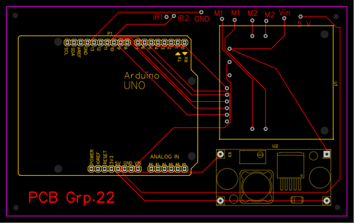
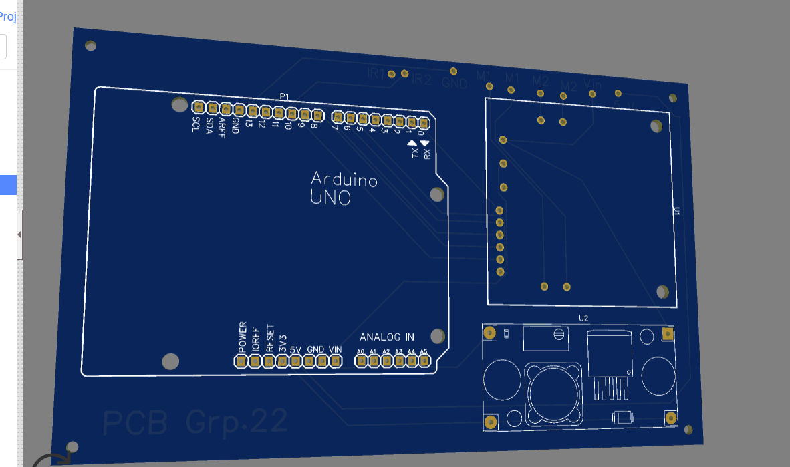

# CAD-Designed Line Following Vehicle

### FDP Project — 2025

**Author:** Satyam Kumar  
**B.Tech Mechanical Engineering | IIT Mandi**

A CAD-designed autonomous line-following vehicle integrating mechanical design, custom PCB design, Arduino-based control, IR sensors, DC motors, and physical prototype testing.

---

# Author

**Satyam Kumar**

B.Tech Mechanical Engineering  
Indian Institute of Technology Mandi

## Project Role

In this project, I worked on the design and development of the line-following vehicle, including:

- Mechanical CAD modelling and vehicle assembly
- Component arrangement and packaging
- PCB design and electrical integration
- Arduino-based control
- IR sensor integration
- DC motor control
- Prototype assembly and testing

This project provided practical experience in integrating mechanical design with electronics and basic embedded control.

---

# Project Overview

This project was developed as an **FDP (Foundation/First-Year Design Project) in 2025**.

The objective was to design and develop a compact vehicle capable of detecting and following a predefined path using infrared sensors.

The project involved the complete integration of:

- Mechanical CAD design
- PCB design
- Arduino programming
- IR sensor-based line detection
- DC motor control
- Mechanical-electrical integration
- Physical prototype development
- Functional testing

The vehicle was first designed digitally using CAD and the electronic system was developed using a custom PCB. The mechanical and electronic systems were then integrated into a physical prototype and tested for line-following operation.

---

# Project Highlights

| Area | Implementation |
|---|---|
| Mechanical Design | CAD-based vehicle design |
| CAD Software | SolidWorks |
| Controller | Arduino UNO |
| Sensors | IR line sensors |
| Drive System | DC motors |
| PCB | Custom PCB |
| Control | Sensor-based motor control |
| Prototype | Physical working vehicle |
| Project Year | 2025 |

---

# CAD Design

The mechanical structure of the vehicle was designed using CAD.

The CAD model was developed to accommodate the major components of the vehicle while maintaining a compact and organized arrangement.

## Main Design Elements

- Main chassis
- Vehicle body/enclosure
- Wheel arrangement
- Motor mounting
- Sensor mounting
- Electronics packaging
- Battery placement

## CAD Assembly


The CAD assembly was used to visualize the complete vehicle and plan the placement of the mechanical and electronic components.

Additional CAD files are available in the `CAD` directory.

---

# Mechanical Design Approach

The mechanical design focused on integrating the drive system, sensors and electronics into a compact vehicle structure.

The main considerations included:

- Component packaging
- Wheel and motor positioning
- Sensor placement
- Ground clearance
- Vehicle stability
- Accessibility of electronic components
- Compactness of the overall assembly

The CAD assembly allowed the different components to be arranged and evaluated before physical prototype assembly.

---

# PCB Design

A custom PCB was designed for the electronic system of the vehicle.

The PCB was used to organize the connections between the controller, sensors, motors and power system.

## PCB Design Included

- Arduino interface
- IR sensor connections
- Motor connections
- Power connections
- Component placement
- PCB trace routing
- Mounting holes

## PCB Layout



## PCB 3D View



The PCB source file and Gerber fabrication files are also included in the repository.

---

# PCB Files

The PCB directory contains the following:

```text
PCB/
│
├── PCB_Layout.png
├── PCB_3D.png
├── PCB_Layout.pdf
│
├── Source/
│   └── PCB_Source.json
│
└── Gerber/
    └── Gerber_Files.zip
